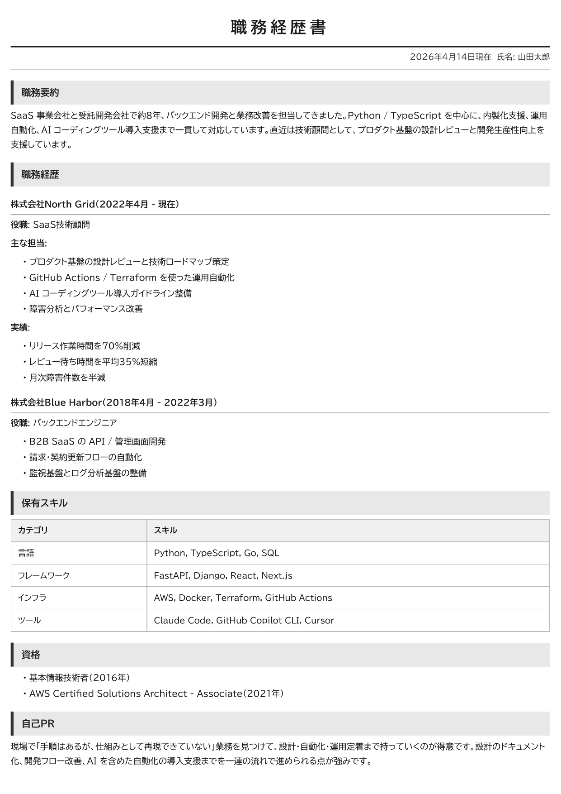
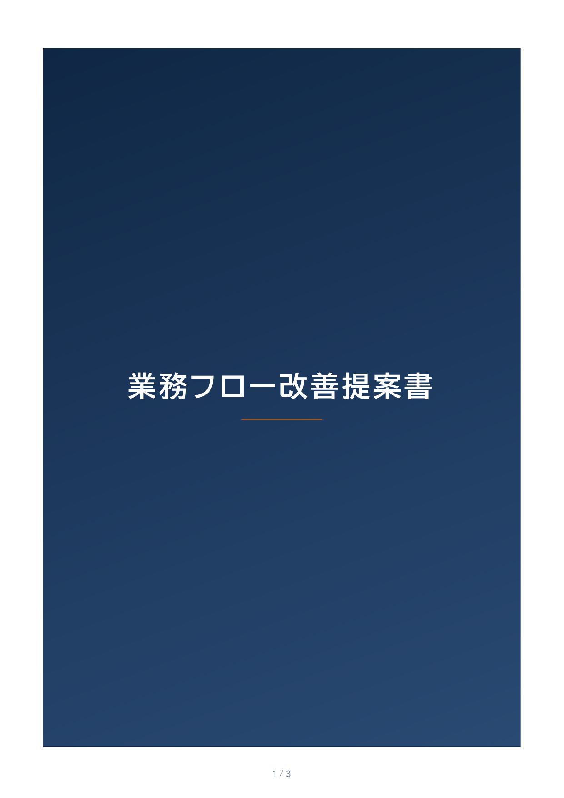
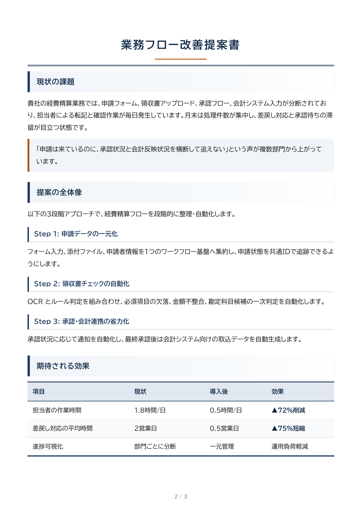
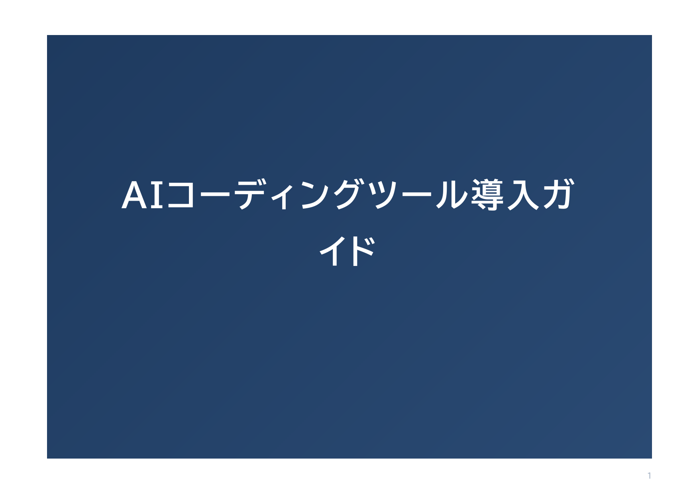
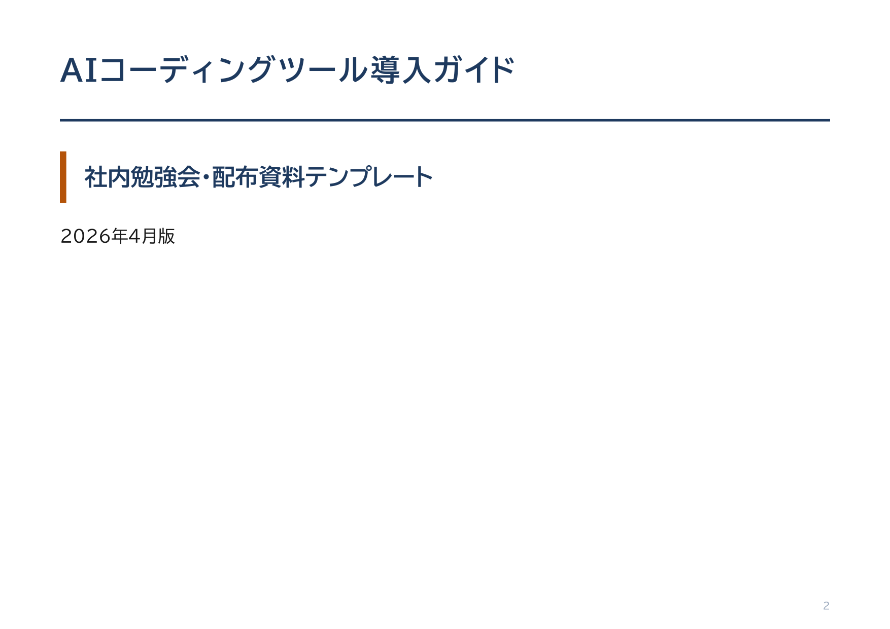

# jp-md-to-pdf

[](https://opensource.org/licenses/MIT)
[](https://www.python.org/downloads/)
[](https://weasyprint.org/)


日本語 Markdown を A4 PDF に変換する、AI コーディングツール向けのローカル skill。

**こんな人向け**: AI コーディングツール（Claude Code / Copilot CLI / Cursor / Codex CLI）で、日本語の履歴書・提案書・請求書・レポートを納品品質の PDF にしたい人。LaTeX も Chrome もいらない。

**weasyprint + BIZ UDPGothic + Noto Sans CJK JP** で動くので、sandbox でも root 権限なしで日本語 PDF が出せる。履歴書・職務経歴書・提案書・note 記事・顧客向け資料・請求書・レポート・スライドなど、日本語ドキュメントの PDF 化をワンコマンドで済ませるのが目的。

## これは何？

このリポジトリは、AI コーディングツール（Claude Code / Copilot CLI / Cursor / Codex CLI など）から `scripts/convert.py` を呼んで、日本語 Markdown をそのまま A4 PDF に仕上げるためのローカル skill / utility。

- 8つのプリセット（履歴書/提案書/レポート/note/請求書/小説/スライド/16:9スライド）を `--preset` 一発で切替
- 表紙ページの自動生成
- A4横向きスライド（`---` で改ページ）
- raw HTML は既定でエスケープ
- 日本語フォントは BIZ UDPGothic（推奨）と Noto Sans CJK JP を内蔵
- 必要なら `scripts/convert.py` を CLI から直接実行できる

## Quick Start

```bash
git clone https://github.com/yoshi-ai-mentor/jp-md-to-pdf
cd jp-md-to-pdf && bash scripts/setup_fonts.sh
python3 scripts/convert.py -i your-doc.md -o output.pdf --preset resume
```

3行で完了。プリセットは `resume` `proposal` `report` `slide` 等 8種。詳細は[使い方](#使い方)を参照。

## こんなのが作れる

すべて `samples/` 配下の Markdown から生成した実物。ワンコマンドでここまで仕上がる。

### 1. 履歴書プリセット（`--preset resume`）

**12mm 10mm** 余白 + **9.5pt** で読みやすさと枚数のバランスを取ったレイアウト。職務経歴書の「ページ数増やしたくない」問題を解決。



### 2. 提案書プリセット（`--preset proposal` + 表紙）

ネイビー × アンバーのカラーアクセントで顧客向けフォーマル。表紙は `--cover-*` オプションで自動生成。ロゴ画像は `--cover-logo` に **ローカルファイルパス**（png / jpg / jpeg / svg / gif、2MB 以下。URL は不可）を渡す。

| 表紙 | 本文 |
|---|---|
|  |  |

### 3. スライドプリセット（`--preset slide`）

A4横向き。Markdown の `---` をスライド区切りに変換。勉強会・配布資料向け。

| 表紙 | スライド本文 |
|---|---|
|  |  |

生成コマンドの実例は下の [使い方](#使い方) 節を参照。

## インストール

このスキルは Claude Code / Copilot CLI / Cursor / Codex CLI など、`scripts/convert.py` を呼べる任意の AI コーディングツールで動く。

### Claude Code で使う

Claude Code のセッション内で以下を指示する:

> このリポジトリをスキルとしてインストールして: `https://github.com/yoshi-ai-mentor/jp-md-to-pdf`

Claude が `~/.claude/skills/jp-md-to-pdf/` 配下にクローンして、依存関係を `setup_fonts.sh` で自動セットアップする。

### その他の AI コーディングツールから使う

任意の AI コーディングツールから使う場合は、このリポジトリをローカルに clone して `scripts/convert.py` を呼ぶ。自然言語の入口はツール側に任せつつ、変換の本体はこのリポジトリで共通化する想定。

### ローカルセットアップ

```bash
git clone https://github.com/yoshi-ai-mentor/jp-md-to-pdf
cd jp-md-to-pdf
bash scripts/setup_fonts.sh
```

macOS の既定 `python3` が 3.9 系なら、`PYTHON_BIN=python3.10 bash scripts/setup_fonts.sh` の形で Python 3.10+ を明示する。

## 使い方

エージェントに自然言語で依頼すれば動く。内部では `scripts/convert.py` が実行されるので、必要なら同じコマンドを手で叩いてもいい。

### ユーザーからの依頼例

```
この職務経歴書.md を履歴書プリセットで PDF にして
↓
Agent: python3 scripts/convert.py -i 職務経歴書.md -o 職務経歴書.pdf --preset resume
       → 1ページで生成完了
```

```
提案書.md を提案書プリセットで、表紙付きで PDF にして。
表紙タイトルは「業務フロー改善提案書」、サブタイトルは「経費精算フローの再設計」、
著者は「業務改善チーム」、日付は今日の日付で。
↓
Agent: convert.py を --preset proposal と --cover-* で叩いて生成
```

### 手動で叩く場合

```bash
# 基本
python3 scripts/convert.py -i input.md -o output.pdf

# プリセット使用
python3 scripts/convert.py -i proposal.md -o proposal.pdf --preset proposal

# プリセット一覧
python3 scripts/convert.py --list-presets

# 表紙付き提案書
python3 scripts/convert.py -i proposal.md -o proposal.pdf \
  --preset proposal \
  --cover-title "業務フロー改善提案書" \
  --cover-subtitle "経費精算フローの再設計" \
  --cover-author "株式会社〇〇" \
  --cover-date ""

# 表紙にロゴを載せる（タイトル行の上・中央。ローカルパスのみ）
python3 scripts/convert.py -i proposal.md -o proposal.pdf \
  --preset proposal \
  --cover-logo samples/sample_logo.svg \
  --cover-title "業務フロー改善提案書"

# A4横スライド
python3 scripts/convert.py -i deck.md -o deck.pdf --preset slide \
  --cover-title "AIコーディングツール導入ガイド"

# 16:9 スライド（PowerPoint 標準に近い 338×190mm）
python3 scripts/convert.py -i samples/06_slide_remote_work.md -o /tmp/slide_16x9.pdf \
  --preset slide-16x9 \
  --cover-title "リモートワーク導入ガイド" \
  --cover-logo samples/sample_logo.svg
```

## 依存

- Python 3.10+
- weasyprint==68.1 / markdown==3.10.2 / pypdf==6.10.1
- BIZ UDPGothic フォント（推奨）または Noto Sans CJK JP

初回のみ `bash scripts/setup_fonts.sh` でフォントと Python 依存を一括セットアップ。
`requirements.txt` / `requirements-lock.txt` には、このリポジトリで確認した exact pins を置いている。

## プリセット

| プリセット | 用途 |
|---|---|
| `resume` | 履歴書・職務経歴書（1-2枚に詰める）|
| `proposal` | 顧客向け提案書（カラーアクセント）|
| `report` | 分析レポート・調査資料 |
| `note-article` | note記事のプリント版 |
| `invoice` | 請求書・見積書 |
| `minimal` | 小説・エッセイ（最小装飾）|
| `slide` | A4横スライド（`---` で改ページ）|
| `slide-16x9` | 16:9 相当（338×190mm・横向き。投影・モニター向け）|

`--list-presets` で詳細一覧が見られる。

スライドの用紙サイズは `--page-size` で上書きできる（`--style slide` または slide 系プリセット時のみ）。例: `--page-size "338mm 190mm landscape"`。

## サンプル

`samples/` に3種類の汎用サンプル MD を入れてある。PDF 生成してみてイメージを掴むのに使える。`samples/output/` はローカル生成用で、リポジトリには含めない。

```bash
python3 scripts/convert.py -i samples/01_resume_sample.md -o samples/output/01_resume.pdf --preset resume
python3 scripts/convert.py -i samples/02_proposal_sample.md -o samples/output/02_proposal.pdf --preset proposal --cover-title "業務フロー改善提案書"
python3 scripts/convert.py -i samples/03_slide_sample.md -o samples/output/03_slide.pdf --preset slide --cover-title "AIコーディングツール導入ガイド"
python3 scripts/convert.py -i samples/06_slide_remote_work.md -o samples/output/06_slide_16x9.pdf --preset slide-16x9 --cover-title "リモートワーク導入ガイド" --cover-logo samples/sample_logo.svg
```

## カスタマイズ

組込みの CSS が気に入らなければ `assets/default.css` / `assets/graphical.css` / `assets/slide.css` をコピーして編集し、`--css path/to/custom.css` で読み込ませれば見た目を完全に差し替えられる。カスタム CSS はローカルの `.css` ファイルだけ受け付ける。

プリセットを追加したければ `assets/presets.json` に追記するだけ。

## セキュリティ

このツールは **信頼できるローカル環境での使用** を前提としている。

- 信頼できない Markdown / HTML / CSS をそのまま変換する用途は推奨しない
- raw HTML は既定でエスケープされる
- 外部 URL フェッチは既定で無効（必要なときだけ `--allow-http`。localhost / private network 宛ては許可しない）
- ローカルファイル参照は既定で無効（必要なときだけ `--allow-local`。入力 Markdown と custom CSS のディレクトリ配下だけ許可）
- **`--cover-logo` は上記とは別経路**。指定したローカル画像だけを表紙用に読み込み、PDF 内は base64 の data URI として埋め込む（`--allow-local` 不要）
- 画像やローカル CSS を本文 Markdown から参照する場合は、入力ファイルと同じ作業ディレクトリ配下に必要な素材を置き、`--allow-local` で許可する

## トラブルシューティング

### 日本語が豆腐（□）になる

```bash
fc-list | grep -i "noto sans cjk jp"   # 空なら要セットアップ
bash scripts/setup_fonts.sh            # 入れ直し
fc-cache -f                            # キャッシュ再生成
```

### ページ数を調整したい

- 詰めたい → `--margin` を小さく、`--font-size` を下げる
- ゆったり → `--margin` を広げる、`--font-size` を上げる

## ライセンス

MIT License。商用利用 OK。

## 出自

日本語の履歴書・提案書・レポート・配布資料を、AI コーディングツールから素早く PDF 化するために整理した skill / converter。

Maintainer: **yoshi_ai_mentor**
